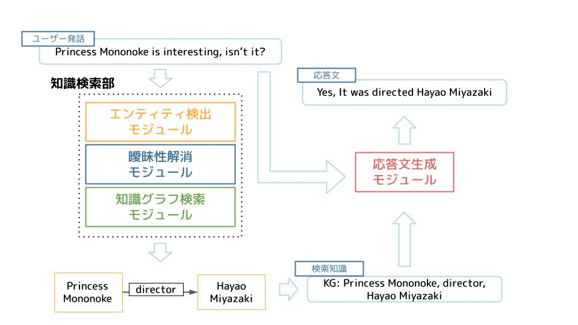
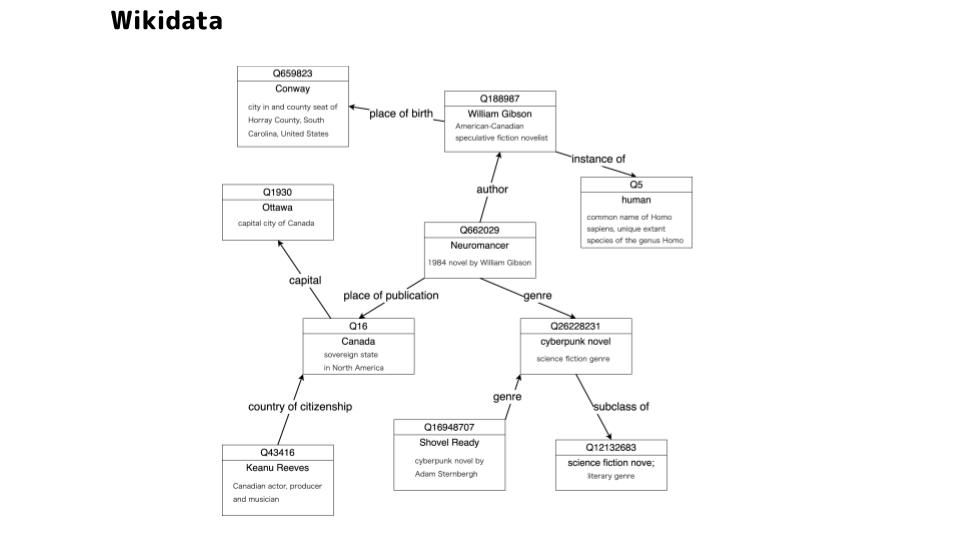

## 雑談対話

　対話システムとは、簡単に言えば人間とおしゃべりができるシステムです。みなさんの身近にあるものだと、Appleの「Siri」やGoogleの「Google Assistant」などが該当します。現在、対話システムは、レストランの予約やタイマーの設定など、いわゆるタスク指向の対話では、実用可能なレベルになっていますが、雑談のような、ユーザーがどのような発話を入力するか、あらかじめ想定できないような対話では、未だに人間らしい応答を出力できないといった問題があります。

 

　深層学習（Deep Neural Network）の技術の発展により、TwitterなどのSNSから、大量の対話データを用意し、学習を行うことで、雑談においても、人間らしい応答の生成ができるようになってきてはいますが、未だに人間と同等の対話能力を実現することはできていません。

 

　我々の研究では、深層学習の技術を中心に用いて、雑談が可能な、人間に近い対話能力を持つシステムの構築を目指しています。

  

### ・Wikidataを外部知識として用いた対話システム
 

　既存の深層学習を用いた雑談対話システムの代表的な問題点として、嘘を含んだ応答を出力してしまうというものがあります。例えば、「大谷翔平って知ってる？」のような入力に対して、「彼はサッカー選手だよね」のような誤った知識を含んだ応答を出力してしまうことがあります。

 

　近年では、このような問題に対して、対話システムにWikipediaのような外部知識にアクセスする能力を与えることで、正しい知識を用いた応答を出力できるようにする研究が行われています。我々は、外部知識として、Wikidataと呼ばれる、知識がグラフで表現されたものを用いた、対話システムの構築を目指しています。Wikidataを外部知識として用いることで、正しい知識を含み、かつ情報に富んだ応答の出力が可能になることが期待されます。

 

<iframe 
src="https://www.youtube.com/embed/hjJ6aHEM2PY
?loop=0
&playlist=hjJ6aHEM2PY
&autoplay=0
&mute=1
&rel=0
&modestbranding=1"
frameborder="0" allowfullscreen>
</iframe>

デモ動画１

<iframe 
src="https://www.youtube.com/embed/oW2BXhw2PcY
?loop=0
&playlist=oW2BXhw2PcY
&autoplay=0
&mute=1
&rel=0
&modestbranding=1"
frameborder="0" allowfullscreen>
</iframe>

デモ動画２

 

### ・最後に

　対話システムの研究は、対話能力という、人間の持つ能力の中でも、非常に高度な能力を、コンピューターで再現する研究であるため、とても難しい研究の1つで、やりがいのあるものだと思います。対話システムの研究に興味がある方は、ぜひ滝口研究室をお尋ねください。

