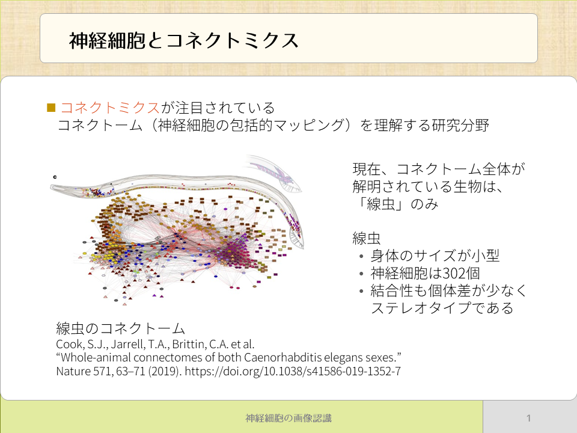
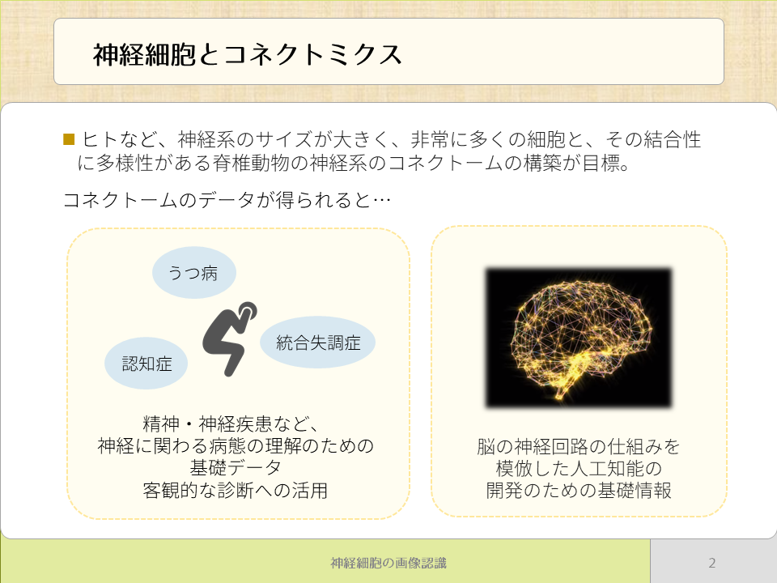
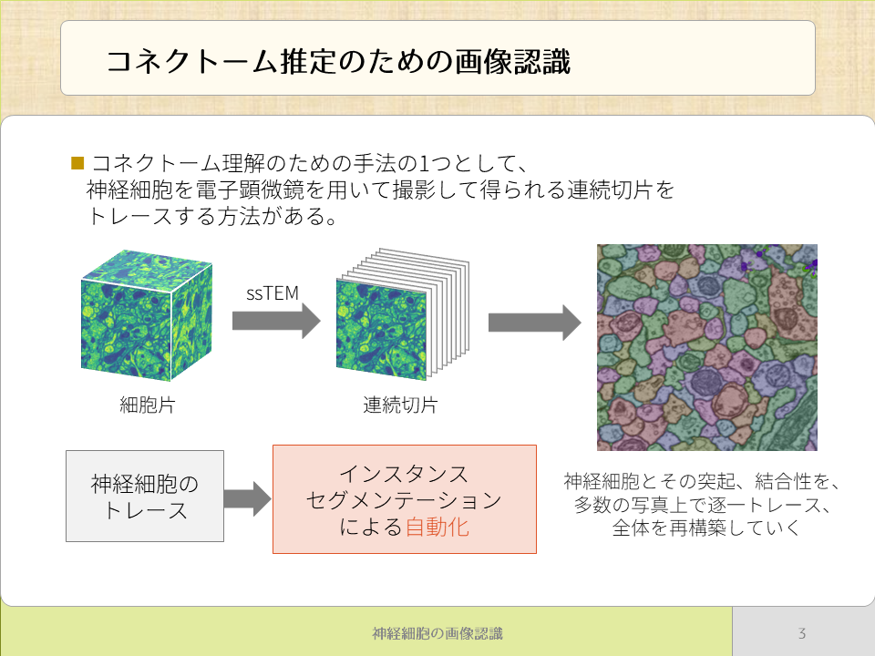
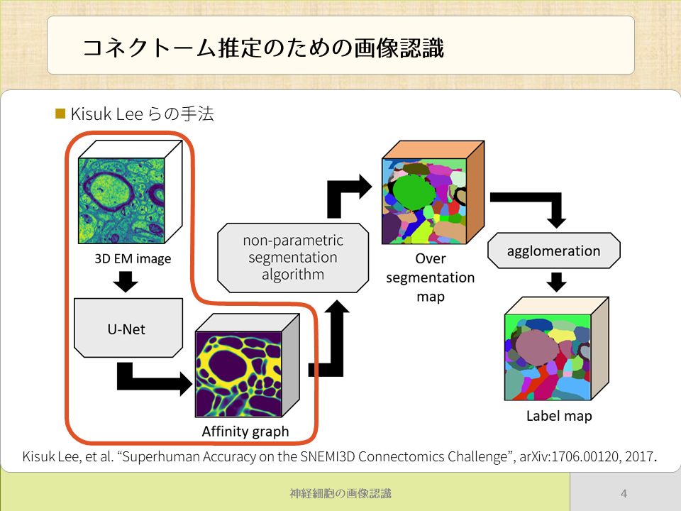
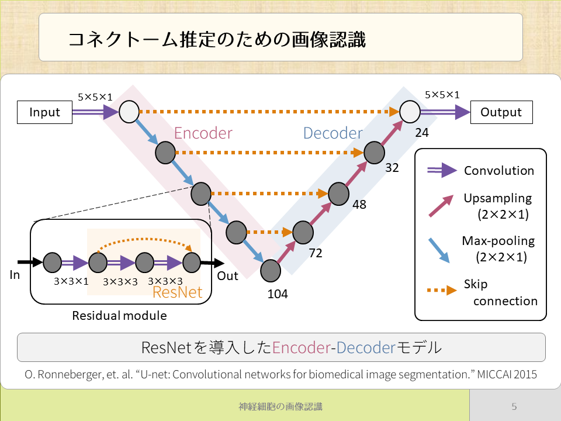

## 神経細胞の画像認識

<section className="wrapper">

# ・神経細胞とコネクトミクス

図1 : コネクトミクスと線虫のコネクトーム．

   

図2 : コネクトミクスの目標とコネクトームの活用法．

神経細胞は，生物の体や精神を理解する上で非常に重要な要素です．

神経細胞同士はシナプスで接続されており，全体として巨大な神経網を形作っています．
この神経網の構造を理解することは，生物の身体的・精神的疾患を理解するために重要なことの1つです．

近年，神経網の理解のために，生物の神経系内の神経細胞の包括的な接続マップ（コネクトームと呼ぶ）を研究するコネクトミクスという研究分野が注目を浴びています．
現在，コネクトームが完全に解明されている生物は線虫（Caenorhabditis elegans）のみです．
線虫の神経系は以下のような特徴があります．
 

・　身体のサイズが小型である． 
・　神経細胞は302個． 
・　結合性も個体差が少なく，ステレオタイプである． 

 
対して，一般的にヒトなどの脊椎動物の神経系は以下のような特徴があります．
  

・　身体のサイズが大きい． 
・　非常に多くの神経細胞からなる． 
・　神経細胞の結合性に多様性がある． 

 
　このような複雑な神経系のコネクトーム構築は非常に難しいとされていますが，これを推定するのがコネクトミクスの目標です．
  
　獲得されたコネクトーム情報は，うつ病や統合失調症、認知症等の神経に関わる病態を理解するために基礎データとしての利用や，これらの疾患の客観的な診断への活用が期待されています．
　 
　また、脳の神経回路の仕組みを模倣した新たな人工知能の開発のための基礎情報としての活用も期待されています．
  
　将来的にはストレスなどの精神的な問題に対する対処法も，コネクトームから明らかにされるかもしれませんし，人間と同じように思考する人工知能も，コネクトームを活用することで生まれるかもしれません．
  
※ 図1：線虫のコネクトーム 
Cook, S.J., Jarrell, T.A., Brittin, C.A. et al.
“Whole-animal connectomes of both Caenorhabditis elegans sexes.” Nature 571, 63–71 (2019). https://doi.org/10.1038/s41586-019-1352-7

# ・コネクトミーム推定のための画像認識

図3 : コネクトーム理解のための手法． 
高コストな神経細胞のトレース作業をインスタンスセグメンテーションによって代替させる．  

図4 : 段階的に処理するセグメンテーション手法． 
深層学習を用いるU-Net部が含まれている．  

図5 : セグメンテーションに用いるU-Net． 
ResNetで提案されたSkip connecionを導入したEncoder-Decoder モデルとなっている．  

　コネクトーム推定の1つの手法として，電子顕微鏡を用いて三次元的に撮影された画像を用いる手法があります．
　連続切片の形で撮影された細胞片の多数の写真に対して，一枚ずつ，神経細胞とその突起，結合性を逐一トレースし，全体を再構築していくものです．この神経細胞のトレースは従来専門家の手により行われていましたが，その作業コストと専門性の高さが問題となってきました． 
 
　 そこで，本研究では，この神経細胞のトレースを画像認識、特にインスタンスセグメンテーションと呼ばれる手法によって代替することを考えています．
　実現すれば，作業コストの削減ができ，更にコネクトーム研究が進むことが期待できます．  

　また，本研究では，セグメンテーション手法として段階的に処理を行う手法を用いています．
　一般画像では，深層学習を用いてEnd-to-Endでセグメンテーションを行う手法も多くありますが，神経細胞画像はその画像の性質上難しいとされており，段階的に処理を行う手法がよく用いられます．
  
　処理中には深層学習（U-Net）を用いる部分もあるため，技術の実用化にあたって，学習のためのデータ不足の問題等も解決することが求められています．
  
※ 図4の手法 
Kisuk Lee, et al. “Superhuman Accuracy on the SNEMI3D Connectomics Challenge”, arXiv:1706.00120, 2017．
  
※ 図5：U-Net 
O. Ronneberger, et. al. “U-net: Convolutional networks for biomedical image segmentation.” MICCAI 2015

</section>