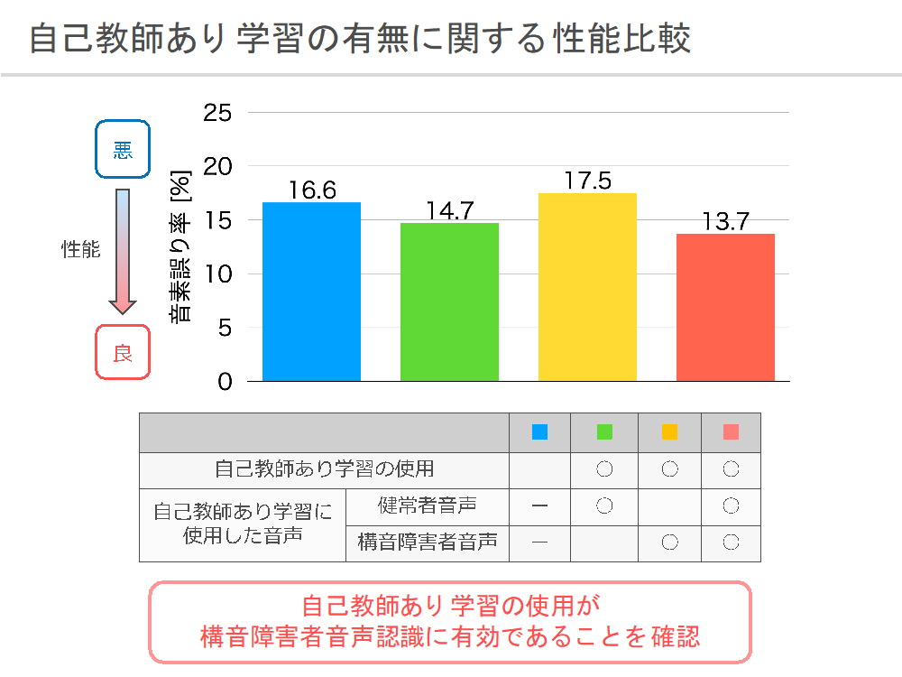

## 脳性麻痺者の音声認識

<section className="wrapper">

近年の音声認識の精度は、大量のデータとDeep Neural Network (DNN)を駆使することにより、人間と同等レベルに達するまでに向上しています。しかしながら、一般的に使用されている音声認識システムは健常者の音声で学習されているため、健常者とは異なった発話をする構音障害者の音声はほとんど認識できないという問題があります。
　我々の研究では、構音障害者のコミュニケーション支援技術の開発の第一歩として、構音障害者の音声認識を取り扱っています。

  

# ・構音障害者の音声を認識するために

 

### ①発話辞書に構音障害者音声の特性を反映

 
構音障害者の音声認識において問題となるのが、健常者と構音障害者の発話スタイルが異なる点です。音声認識における音響モデルは、通常音素単位でモデル化されており、音素列から単語列への変換には、単語の発音情報を定義した発話辞書が用いられます。 
　しかし、構音障害者は発話辞書に定義された通りに正しく発音することが難しく、一般的に用いられている発話辞書を構音障害者音声認識に用いることは、必ずしも適切ではないと考えられます。
　 
我々の研究では、構音障害者音声に対する音素認識モデルでの認識結果から、音素の誤認識パターンを分析し発話辞書を修正することで、音声認識における精度を向上することを確認しました。

### ②構音障害者のラベル無し音声データの利用

これまでの研究で使用されてきた構音障害者の発話データは、構音障害者があらかじめ用意された台本の文章を読み上げ、その発話音声を録音したものです。
このような音声の収集方法では構音障害者の身体にとって負担が大きいため、大量のデータを集めることは困難となります。
より多くの構音障害者の音声を使用するためには、比較的身体への負担が小さく多量の音声を収集できる自由発話音声を使用するという方法が考えられますが、自由発話を人手により発話内容を認識して文字起こしを行うことは難しいので、これらの音声はラベルの無いデータとして扱うことになります。
  

　我々はこのラベルの無い構音障害者音声を音声認識に活用することで、音声認識精度を向上させる研究を行なっています。
ラベルの無いデータをモデルの学習に使用するアプローチとしては、自己教師あり学習という手法があります。
これは目的のタスクに有効なデータの特徴表現を、事前に別のタスクを解くことによって獲得するというものであり、入力データに対して自動生成できる情報を教師ラベルとしてモデルの学習を行います。
我々の研究ではラベルの無い音声データを用いて、過去の音声情報から将来の音声を予測するモデルを事前に学習し、そのモデルの一部を音声認識に流用します。
実験の結果、自己教師あり学習で得られたモデルを音声認識に使用することで、音声認識精度を向上できることが確認されました。

# ・最後に（新B4の方へ）

　音声認識は高い性能を達成し、既に研究し尽くされているように思われる方もいるかもしれませんが、性能が大きく向上したからこそ、音声認識をツールとして別の研究テーマを模索することが可能になったと言えます。
また、少量データでの音声認識や雑音環境下での音声認識、方言の音声認識など、まだまだ課題のある分野も多く、たくさんの研究・改善の余地があります。

音声認識に興味があり研究をしてみたい方は、是非滝口研究室までお尋ねください。

</section>