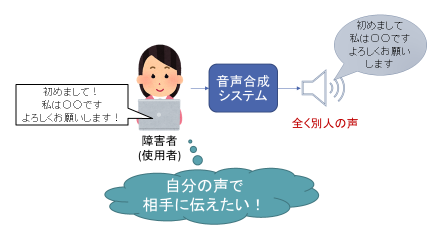
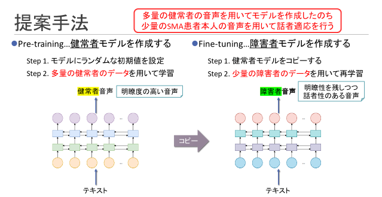
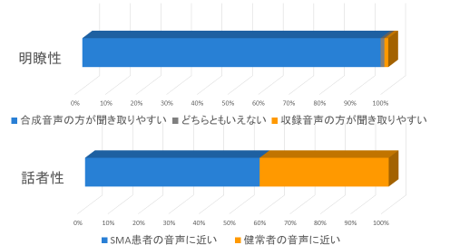
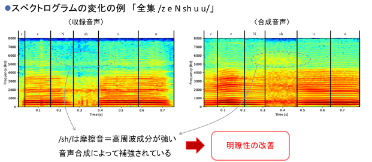

## 脊髄性筋萎縮症者の音声合成

<section className='wrapper'>

テキスト音声合成とは、文章（テキスト）を入力すると、その音声を機械が生成する技術です。

「音声合成」という言葉を聞いたことが無くても、そのシステム自体は「Siri」や「Googleアシスタント」など、様々なアプリケーションで見たことがあると思います。

この技術は、機械との対話だけでなく、発話障害者のコミュニケーション支援にも役立てられることが期待されています。（発話障害者：運動に関する神経等の病気により、発話が困難な方。）

しかし、現状のテキスト音声合成システムは、あらかじめ機械に学習させた人の音声しか生成することができません。

そのため、発話障害者の方が入力した文章は、障害者の方とは全く別人の声で読み上げられることになります。

もちろんこれでも、障害者の方の言いたいことを伝えることはできますが、「より自分らしい」コミュニケーションするために、自分の声で生成したいという要望が、障害者ご自身やそのご家族、友人などから沢山寄せられています。

私たちは、発話障害者の方が、障壁（バリア）を一切感じること無く、自然なコミュニケーションができる世界を目指し、発話障害者のための音声合成技術を研究しています。

  

# ・発話障害者音声合成の研究の難しさ
 
       この研究は、通常の音声合成の研究と異なり、主に２つの難しい課題があります。
   

### 1) 学習データが極めて少ない
一般に音声合成では、機械にその人の声を学習させるため、数時間～数十時間の学習データが必要です。

しかし、発話障害者の声を収録することは、障害者の方にとって負担がとても大きく、収録に数日かけても、得られるデータはせいぜい1時間にも達しません。

ですので、少量の学習データという条件下で、いかに上手く音声合成モデルを学習するかが課題となっています。
   

### 2) 正解データが存在しない
これは一つ目の課題よりもさらに難しい課題です。

発話障害者の音声は、聞き取りが難しい明瞭度の低い音声です。

ですので、仮に発話障害者音声を沢山集められたとしても、聞き取りにくい音声で学習されたモデルは、やはり聞き取りにくい音声しか生成できません。

したがって、コミュニケーション支援に使える音声合成モデルを学習するためには、学習時の正解データとして、本人の声・かつ明瞭度の高い音声が必要なのですが、そのような音声は存在しません。

   

# ・提案のアプローチ

 

そこで私たちは、少量の発話障害者の音声に加えて、健常者の音声も利用するアプローチを提案しました。
健常者の音声は障害者音声と比べて大量に収集できます。
また、健常者の持つ「高い明瞭性」と、発話障害者の持つ「音声の個人性」をうまく融合させることで、発話障害者本人の声に近く、かつ明瞭度の高い音声を生成可能なモデルの学習を試みました。

　提案手法では、まず健常者の音声を学習データとして、ディープニューラルネットワーク型のテキスト音声合成モデルを学習させます。
そして、学習された音声合成モデルのパラメータを初期値として、さらに発話障害者の音声を学習データとして、音声合成モデルの再学習を行います。

 

 

# ・脊髄性筋萎縮症（SMA）者を対象とした音声合成実験

  

　提案手法を用いて、脊髄性筋萎縮症（SMA）による発話障害者を対象として、音声合成実験を行いました。

提案手法を用いて合成した音声の聴取実験を行った結果、「元々の発話障害者音声よりも合成音声の方が聞き取りやすい」という回答が97.5%となりました。

また合成音声が、障害者本人の声と別人の健常者の声のどちらに近いかという質問に関しては、57.5%が障害者本人の声に近い、という回答が得られました。

このことから、ある程度の本人らしさを担保しつつ、聞き取りやすい音声が合成できたことが確認できました。

  

  

# ・新B4へのメッセージ

 

　音声合成の研究は、処理結果を耳で聞いて確認できることが面白い点だと思います。
　「ここの処理をこうしてみたら、どんな音声ができるだろうか？」など、ワクワクしながら実験ができるはずです。
　興味のある方は是非一緒に研究しましょう！

</section>