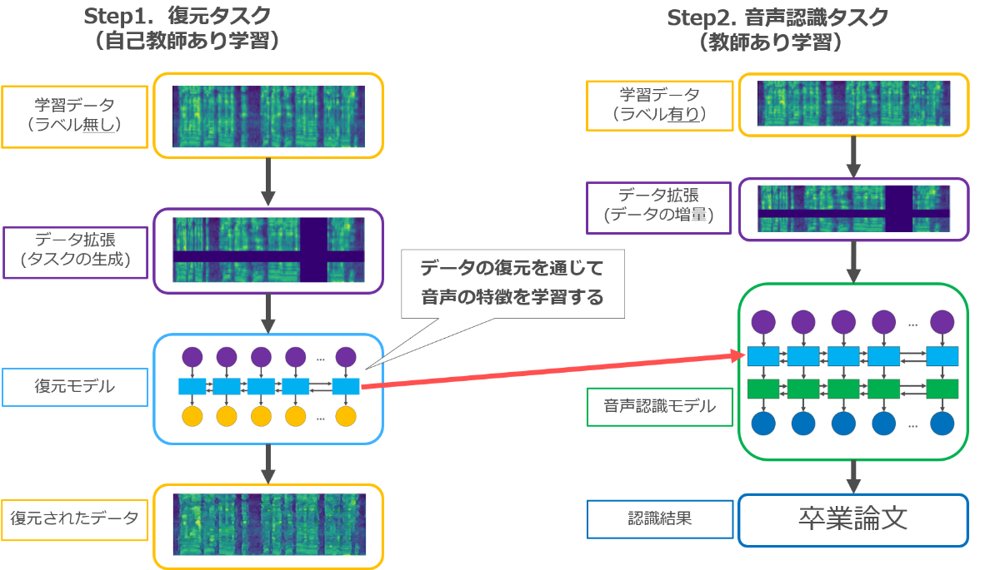
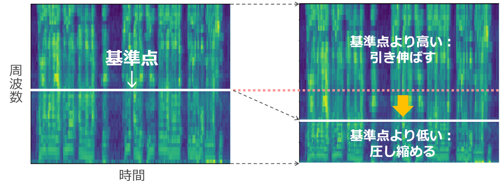

## 口唇口蓋裂者の音声認識

<section className="wrapper">

　口唇口蓋裂は唇や上顎に裂け目ができる先天的な病気のことで、患者の声が聞き取りにくくなる症状があります。
　健常者を対象にした従来の深層学習に基づく音声認識システムでは、このような口唇口蓋裂者の声を高精度に認識できないため、支援のために口唇口蓋裂者用のシステムが必要となっています。

 

　口唇口蓋裂者用の音声認識システムを構築するためには、利用者本人の声をできるだけ多く学習させることが重要ですが、そのために大量の文章を読み上げてもらうのは患者にとって重い負担になってしまいます。
　本研究では少量の発話データで音声認識システムを学習させるため、データを加工する技術である「データ拡張」によって、データの増量や、ラベルのない音声の活用（自己教師あり学習）を行いました。

 

　健常者の音声認識に用いられてきたデータ拡張でも効果は期待できますが、より高い認識性能にするためには、口唇口蓋裂者の音声の性質に合った学習が必要です。本研究では、口唇口蓋裂者の声は周波数の変動が大きいという点に着目し、周波数方向の変形を行う新しいデータ拡張を提案しました。これにより、従来手法のみで音声認識システムを構築した場合に比べ、相対的に10%程度精度が改善することを確認しました。

図1：本研究における深層学習による音声認識モデル学習の流れ

まず、データ拡張されたデータを元通りに復元させることで自己教師あり学習を行います。その後、データの増量を行いながら音声認識タスクを学習します。
  

図2：提案手法である「周波数伸縮」の概要。

ランダムな周波数を選び、これを基準にデータを変形させることで、様々なパターンの変動を再現します。

</section>